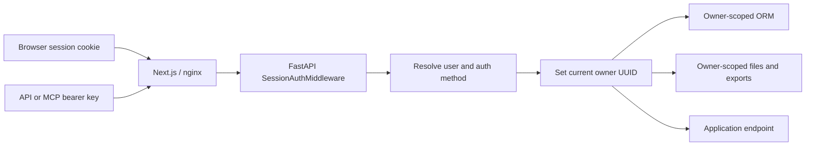

# Multi-user authentication implementation

This document explains the multi-user authentication and tenant-isolation work in
the current Presenton workspace compared with the local `main` branch. It covers
the implementation, compatibility behavior, request flows, security boundaries,
production rollout, and known limitations.

## Review snapshot

| Item | Value |
| --- | --- |
| Review date | 2026-07-25 |
| Baseline | local `main` at `57b194b234b42c8b28f8a507a30322de200e3e83` |
| Feature branch | `feat/added-multi-user-auth` |
| Feature branch HEAD | `66b72af54` |
| Branch commits after the fork | `5c97efd40`, `66b72af54` |
| Scope | committed feature work plus the current production-hardening worktree |

> Important: some of the final hardening described here is not yet committed.
> Deploying only `66b72af54` will not deploy every reviewed fix. Commit the
> migrations, auth helpers, tests, and other intentional worktree changes before
> building the production image.

The branch also contains changes unrelated to authentication, including large
template JSON updates, `.DS_Store` files, Playwright captures, and version
metadata. Those are outside this review and should be separated or explicitly
approved before merging.

## Executive verdict

The current workspace replaces the single shared credential system with:

- database-backed username accounts;
- one protected primary administrator;
- administrator-created standard users;
- database-backed, versioned JWT browser sessions;
- administrator-owned API/MCP keys;
- automatic per-user ORM query filtering and write ownership;
- per-user app-data, temporary-file, conversion, and export directories;
- upgrade logic that assigns existing data to the migrated administrator;
- compatibility preservation for `userConfig.json` credentials and old password
  hashes;
- admin-only user, provider-setting, and API-key management;
- authenticated export and internal rendering requests;
- login throttling and static-file authorization.

The four original requirements are addressed as follows:

| Requirement | Implementation |
| --- | --- |
| Existing `app_data` must remain usable | Legacy database rows are assigned to the migrated primary admin. Legacy files stay in their existing root paths and are accessible only to that admin. New files use `users/<user-id>/...`. |
| Credentials in `userConfig.json` must not be lost | Authentication fields are preserved when provider settings are migrated or updated. Writes are atomic, a backup is maintained, and credential files are forced to mode `0600`. |
| Existing user becomes admin | Startup migrates the legacy username and password hash into a database `User` with `is_superuser=True` and `admin_slot="primary"`. |
| Security gaps must be addressed | JWT sessions, session version invalidation, owner-scoped ORM queries, app-data authorization, traversal checks, realpath checks, login limits, admin-only operations, and authenticated export/internal calls were added. Remaining limitations are documented below. |

### Production decision

For an installation that already has configured single-user credentials, the
design is suitable for a staged production rollout after the following release
conditions are completed:

1. commit all reviewed worktree hardening;
2. revoke the credential exposed in repository history;
3. migrate and smoke-test a clone of production data;
4. run `nginx -t` in the final image;
5. verify PDF and PPTX exports through the deployed proxy/TLS topology.

For a legacy installation with data but no configured credential, either
preseed the administrator during the first upgraded boot or implement the
setup-time backfill described under known limitations.

This review is code- and test-based. It is not a substitute for a penetration
test of the final network deployment.

## What changed from `main`

### Previous design on `main`

`main` used one username and password hash stored directly in
`userConfig.json`. It issued a custom HMAC token containing the username:

```python
payload = {
    "v": 1,
    "u": username,
    "iat": issued_at,
    "exp": issued_at + SESSION_TTL_SECONDS,
}
signature = hmac.new(
    secret.encode("utf-8"),
    payload_encoded.encode("utf-8"),
    hashlib.sha256,
).digest()
```

That design had no database user identity, no roles, and no owner column on
presentations or related records. Some app-data roots were public so the browser
and export renderer could load them.

Basic authentication and a bearer form of the custom browser token were also
accepted by the old middleware. Trusted internal calls created another copy of
the same custom token.

### Current design

The current implementation has two authentication methods:

1. A browser receives a database-backed JWT in an HTTP-only cookie.
2. An API or MCP client sends an administrator-generated
   `Authorization: Bearer sk-presenton-...` key.

Both methods resolve to a concrete database user. The middleware installs that
user's UUID in a request-local context. Database and filesystem operations use
the UUID as their ownership boundary.



## Database model

### User

The new account model is username-only:

```python
class User(UserBase):
    __tablename__ = "user"

    id = mapped_column(Uuid, primary_key=True, default=uuid.uuid4)
    username = mapped_column(
        String(128), unique=True, index=True, nullable=False
    )
    admin_slot = mapped_column(
        String(32), unique=True, nullable=True
    )
    hashed_password = mapped_column(String(1024), nullable=False)
    is_active = mapped_column(Boolean, nullable=False, default=True)
    is_superuser = mapped_column(Boolean, nullable=False, default=False)
    is_verified = mapped_column(Boolean, nullable=False, default=True)
    auth_version = mapped_column(Integer, nullable=False, default=1)
```

Relevant source:
[models/sql/user.py](../servers/fastapi/models/sql/user.py).

`admin_slot="primary"` provides a unique database value used to prevent two
concurrent setup requests from both creating the primary administrator.

The unique slot guarantees one row named `primary`; it does not independently
guarantee that no manually edited database row can have
`is_superuser=True, admin_slot=NULL`. Application APIs never create such a row,
but direct database administration must preserve this invariant.

### API access tokens

API keys are stored in `access_tokens` and belong to a user:

```python
class AccessToken(SQLModel, table=True):
    token: str = Field(
        default_factory=lambda: f"sk-presenton-{secrets.token_hex(20)}",
        primary_key=True,
    )
    user_id: uuid.UUID = Field(
        sa_column=Column(
            ForeignKey("user.id", ondelete="CASCADE"),
            nullable=False,
        )
    )
```

Only the administrator can create keys through the supported API. Middleware
also requires the owning user to remain active and a superuser before accepting
a key.

Relevant source:
[models/sql/access_token.py](../servers/fastapi/models/sql/access_token.py).

### Owned records

The migration adds nullable `owner_id` foreign keys to:

- presentations;
- slides;
- presentation layout code;
- legacy templates;
- Template V2 records;
- template creation metadata;
- image assets;
- chat history;
- async tasks;
- legacy async presentation-generation status;
- webhook subscriptions.

A representative model field is:

```python
owner_id: Optional[uuid.UUID] = Field(
    default_factory=get_current_owner_id,
    exclude=True,
    sa_column=Column(
        ForeignKey("user.id", ondelete="CASCADE"),
        nullable=True,
        index=True,
    ),
)
```

The columns remain nullable for migration compatibility and for shared built-in
templates. Standard private records should have an owner after startup
backfilling.

### Shared and global records

Not every record is user-private:

- built-in Template V2 rows with `owner_id=NULL` and `is_default=True` are
  shared;
- fonts and packaged templates are shared;
- provider/LLM settings are instance-wide, not per-user;
- the primary administrator's API keys are instance-level automation keys;
- custom themes use a user-specific key such as
  `presentation_custom_themes:<user-id>`.

This means users have private content workspaces but use the same administrator
configured LLM/image provider configuration.

## Alembic migration chain

Three migrations implement the database transition:

1. `c9f1a2b3d4e5_multi_user_auth_and_ownership.py`
   creates users, access tokens, and owner columns.
2. `d0a2b4c6e8f1_username_only_provider_settings.py`
   finalizes username-only accounts and creates the provider-settings singleton.
3. `e1b3c5d7f9a2_primary_admin_slot.py`
   adds and uniquely indexes the primary administrator slot.

The final migration is currently a worktree file and must be committed.

The ownership migration intentionally adds nullable columns first:

```python
with op.batch_alter_table(table) as batch:
    batch.add_column(sa.Column("owner_id", sa.Uuid(), nullable=True))
    batch.create_index(f"ix_{table}_owner_id", ["owner_id"])
    batch.create_foreign_key(
        f"fk_{table}_owner_id_user",
        "user",
        ["owner_id"],
        ["id"],
        ondelete="CASCADE",
    )
```

Startup then creates or finds the administrator and backfills existing rows.
This avoids losing records during the schema transition.

`MIGRATE_DATABASE_ON_STARTUP=true` is configured for Compose deployments. The
migration runner also recognizes populated legacy databases and repairs an
orphaned Alembic revision by inferring the nearest valid revision from the live
schema.

Relevant sources:

- [multi-user migration](../servers/fastapi/alembic/versions/c9f1a2b3d4e5_multi_user_auth_and_ownership.py)
- [provider-settings migration](../servers/fastapi/alembic/versions/d0a2b4c6e8f1_username_only_provider_settings.py)
- [primary-admin migration](../servers/fastapi/alembic/versions/e1b3c5d7f9a2_primary_admin_slot.py)
- [migration runner](../servers/fastapi/migrations.py)

## Startup and legacy upgrade behavior

The application starts in this order:

```python
await migrate_database_on_startup()
await create_db_and_tables()
await bootstrap_database_admin()
await migrate_provider_settings_from_file(session)
await import_default_templates_on_startup()
```

Relevant source:
[api/lifespan.py](../servers/fastapi/api/lifespan.py).

### Upgrade with existing single-user credentials

When `userConfig.json` has `AUTH_USERNAME` and `AUTH_PASSWORD_HASH`, and no
database user exists:

1. The legacy username and encoded hash are read.
2. A database user is created with the same credentials.
3. The user is marked active, verified, superuser, and primary administrator.
4. Existing unowned records are assigned to that user.
5. Existing non-default custom templates are assigned to that user.
6. The legacy custom-theme key is renamed to include the new user UUID.
7. The credential copy remains in `userConfig.json`.

The main backfill is:

```python
for model in owned_models:
    await session.execute(
        update(model)
        .where(model.owner_id.is_(None))
        .values(owner_id=admin.id)
    )

await session.execute(
    update(TemplateV2)
    .where(
        TemplateV2.owner_id.is_(None),
        TemplateV2.is_default.is_(False),
    )
    .values(owner_id=admin.id)
)
```

Relevant source:
[auth/bootstrap.py](../servers/fastapi/api/v1/auth/bootstrap.py).

### Fresh installation

If no database user and no environment or legacy credential exists, startup
does not invent credentials. `/api/v1/auth/status` returns
`configured: false`, and the login screen offers initial setup.

The setup transaction creates:

```python
User(
    username=username,
    hashed_password=password_hash,
    is_active=True,
    is_verified=True,
    is_superuser=True,
    admin_slot="primary",
    auth_version=1,
)
```

The unique `admin_slot` causes a concurrent second setup to fail with a
conflict instead of creating another primary admin.

### Recovery and environment override

`RESET_AUTH=true` or `AUTH_OVERRIDE_FROM_ENV=true` updates the existing admin
in place when `AUTH_PASSWORD` is supplied:

```python
admin.hashed_password = PASSWORD_HELPER.hash(env_password)
admin.auth_version += 1
await session.execute(
    delete(AccessToken).where(AccessToken.user_id == admin.id)
)
persist_admin_credentials(
    admin.username,
    admin.hashed_password,
    rotate_secret=True,
)
```

This preserves the user UUID and every `owner_id` relationship. It invalidates:

- existing browser JWTs through `auth_version` and secret rotation;
- existing API keys by deleting them.

Startup refuses to run a reset/override without `AUTH_PASSWORD`, because
replacing or deleting the account would orphan or cascade-delete user data.

### Legacy data without legacy credentials

There is one upgrade edge case: if an old installation has unowned data but has
never configured legacy credentials and has no environment bootstrap
credentials, startup cannot identify an owner. The later `/setup` endpoint
creates an admin but does not currently call the legacy ownership backfill.

For such an installation, preseed `AUTH_USERNAME` and `AUTH_PASSWORD` on the
first upgraded boot so startup creates the admin and performs the backfill. This
should be converted into an automated setup-time backfill before claiming
support for credential-less legacy installations.

## Browser authentication

### Endpoints

| Endpoint | Public before login | Purpose |
| --- | --- | --- |
| `GET /api/v1/auth/status` | Yes | Reports setup and cookie session state |
| `POST /api/v1/auth/setup` | Yes | Creates the first primary administrator |
| `POST /api/v1/auth/login` | Yes | Verifies credentials and sets the JWT cookie |
| `POST /api/v1/auth/logout` | Yes | Clears the browser cookie |
| `GET /api/v1/auth/verify` | Authenticated | Used by nginx and API-key verification |

### Password behavior

New passwords must be between 8 and 128 characters. Login permits a minimum of
6 characters only so passwords created by the previous release still work.

The password helper detects the old PBKDF2 format:

```python
if hashed_password.startswith("pbkdf2_sha256$"):
    verified = verify_legacy_password_hash(
        plain_password,
        hashed_password,
    )
    return verified, self.hash(plain_password) if verified else None
```

After a successful old-hash login, the database hash is automatically upgraded
to the password library's current format.

The compatibility verifier is intentionally retained in
[auth/config.py](../servers/fastapi/api/v1/auth/config.py). The obsolete
single-user setup, Basic Auth, custom token, and credential-deletion functions
were removed with `utils/simple_auth.py`.

### JWT session

The JWT contains the database user ID and account authentication version:

```python
return generate_jwt(
    {
        "sub": str(user.id),
        "av": user.auth_version,
        "aud": self.token_audience,
    },
    self.encode_key,
    self.lifetime_seconds,
    algorithm=self.algorithm,
)
```

Token validation rejects a session if:

- the signature or audience is invalid;
- the subject is not a valid user UUID;
- the account is missing or inactive;
- the JWT lacks an integer `av` claim;
- the claim differs from the current database `auth_version`.

The cookie is:

- named `presenton_session`;
- HTTP-only;
- `SameSite=Lax`;
- scoped to `/`;
- valid for 30 days;
- marked `Secure` when the request is HTTPS or nginx supplies
  `X-Forwarded-Proto: https`.

The login response no longer returns the browser JWT in JSON.

Relevant source:
[auth/users.py](../servers/fastapi/api/v1/auth/users.py).

### Session invalidation

Resetting a standard user's password increments `auth_version`, immediately
invalidating existing JWTs for that user. Administrator environment recovery
does the same and also rotates the signing secret.

Logout only deletes the current browser cookie. It does not maintain a
server-side JWT denylist, so a copied JWT remains usable until expiry or an
`auth_version`/secret change.

### Login throttling

Two layers exist:

1. An in-process limiter allows five failures per
   `client-address + case-folded username` in five minutes.
2. nginx limits `/api/v1/auth/login` to 10 requests per minute per address,
   with a burst of 5.

```nginx
limit_req_zone $binary_remote_addr zone=auth_login:10m rate=10r/m;

location = /api/v1/auth/login {
  limit_req zone=auth_login burst=5 nodelay;
  limit_req_status 429;
  proxy_pass http://localhost:8000;
}
```

The in-process state is not shared across multiple FastAPI replicas. A
distributed deployment should use a shared limiter at the ingress or data-store
level.

## API and MCP authentication

The principal resolver first checks the browser JWT, then a Presenton API key:

```python
cookie_token = request.cookies.get(SESSION_COOKIE_NAME)
if cookie_token:
    # Decode JWT and load its user.

authorization = request.headers.get("Authorization", "")
if authorization.lower().startswith("bearer "):
    token = authorization.split(" ", 1)[1].strip()
    if not token.startswith("sk-presenton-"):
        return None, None
    access_token = await session.get(AccessToken, token)
```

Accepted API keys must belong to an active superuser. API keys can call the
Presenton API but are explicitly rejected as browser sessions for local Next.js
configuration routes and admin operations.

The MCP server:

- is disabled in Electron;
- requires a valid administrator API key when auth is enabled;
- forwards that same bearer key to FastAPI;
- exposes only presentation generation, async generation, and generation
  status tools.

Relevant source:
[mcp_server.py](../servers/fastapi/mcp_server.py).

Current key limitations:

- tokens are stored in plaintext because their complete value is used as the
  database lookup key;
- tokens have no expiration;
- tokens have no scopes beyond administrator-only ownership;
- the admin UI can list and reveal existing complete tokens.

For a higher-security deployment, store only a token digest, show a token only
once at creation, add expiration and last-used timestamps, and define scopes.

## Request authorization pipeline

### FastAPI middleware

Except for setup/login/status/logout and explicitly shared assets, protected
requests pass through `SessionAuthMiddleware`.

The middleware:

1. verifies the database has an account;
2. resolves the browser JWT or API key;
3. enforces browser-admin-only routes;
4. authorizes app-data paths;
5. stores the principal on `request.state`;
6. installs the user UUID and admin flag in `ContextVar` values;
7. runs the endpoint;
8. resets the context in `finally`.

```python
request.state.auth_principal = principal
request.state.current_user = user

context_token = set_current_owner_id(principal.user_id)
admin_context_token = set_current_owner_is_admin(principal.is_admin)
try:
    return await call_next(request)
finally:
    reset_current_owner_is_admin(admin_context_token)
    reset_current_owner_id(context_token)
```

API keys are allowed for normal API calls. These paths require a browser admin
JWT:

- `/api/v1/admin/*`;
- `/api/v1/auth/token/*`;
- `/api/v1/ppt/codex/auth/*`;
- font mutation operations;
- Ollama model pull.

Relevant source:
[api/middlewares.py](../servers/fastapi/api/middlewares.py).

### Next.js protection

Server layouts call `requireAppSession()` for the application and
`requireAdminSession()` for admin-only pages. The settings page renders the full
provider/admin interface for administrators and an account-only username/sign-out
view for standard users. Next.js API routes separately call the FastAPI
auth-status endpoint with the incoming cookie.

The proxy forwards `/api/v1` and `/api/v2` to FastAPI and rejects API keys on
local Next.js routes:

```typescript
if (authorization.toLowerCase().startsWith("bearer sk-presenton-")) {
  return isFastApiApiPath(pathname)
    ? rewriteToFastApi(request)
    : NextResponse.json(
        { detail: "API keys are only accepted by the Presenton API" },
        { status: 403 }
      );
}
```

Template compilation and layout validation are no longer public proxy
exceptions. Trusted FastAPI calls now obtain a real database JWT for the current
owner.

Relevant sources:

- [servers/nextjs/proxy.ts](../servers/nextjs/proxy.ts)
- [servers/nextjs/utils/serverAuth.ts](../servers/nextjs/utils/serverAuth.ts)
- [auth/internal.py](../servers/fastapi/api/v1/auth/internal.py)

## ORM tenant isolation

The SQLAlchemy session has two global hooks.

### Read filtering

Every ORM `SELECT` executed while an owner context is active receives loader
criteria:

```python
for model in _STRICT_OWNER_MODELS:
    statement = statement.options(
        with_loader_criteria(
            model,
            lambda row: row.owner_id == owner_id,
            include_aliases=True,
        )
    )
```

Template V2 is special: a user can read their own template or a shared default:

```python
with_loader_criteria(
    TemplateV2,
    lambda row: or_(
        row.owner_id == owner_id,
        (row.owner_id.is_(None) & row.is_default.is_(True)),
    ),
)
```

### Write stamping

New owned ORM objects are automatically stamped:

```python
for instance in session.new:
    if isinstance(instance, owner_models):
        instance.owner_id = owner_id
```

Sensitive bulk deletes in presentations and chat history additionally include
an explicit `owner_id == current_owner_id` predicate because the global read
hook does not scope arbitrary bulk update/delete statements.

Relevant source:
[services/database.py](../servers/fastapi/services/database.py).

### Isolation properties and limits

This provides broad defense against an endpoint accidentally forgetting an
owner filter on an ORM read. However:

- it is application/ORM enforcement, not PostgreSQL row-level security;
- raw SQL and bulk mutations must be reviewed separately;
- `skip_owner_scope` is an available execution option, though there are
  currently no application callers;
- nullable ownership exists for migration/shared-template compatibility;
- database access outside the configured session/hooks can bypass it.

For defense in depth on PostgreSQL, row-level-security policies are still worth
considering.

## Filesystem and app-data isolation

### Directory layout

New user-private files use:

```text
app_data/
  images/users/<user-id>/
  uploads/users/<user-id>/
  exports/users/<user-id>/
  pptx-to-html/users/<user-id>/
  pptx-to-json/users/<user-id>/

TEMP_DIRECTORY/
  <user-id>/
```

Shared roots are:

```text
app_data/fonts/
app_data/templates/
```

Pre-multi-user files remain in their legacy root locations. They are not moved
or renamed during migration. Only the migrated primary admin can access those
legacy root files.

### Browser asset authorization

The path authorizer repeatedly URL-decodes the request, rejects NULs,
backslashes, empty segments, `.` and `..`, and recognizes only known
`/app_data` roots.

```python
if relative_parts[0] == "users":
    return (
        len(relative_parts) >= 3
        and relative_parts[1] == str(user_id)
    )

# Legacy root data belongs only to the migrated primary admin.
return is_admin
```

nginx uses an internal FastAPI auth subrequest before serving private aliases:

```nginx
location = /_auth_check {
  internal;
  proxy_pass http://localhost:8000/api/v1/auth/verify;
  proxy_set_header X-Original-URI $request_uri;
  proxy_set_header Cookie $http_cookie;
  proxy_set_header Authorization $http_authorization;
}

location /app_data/exports/ {
  auth_request /_auth_check;
  alias /app_data/exports/;
  disable_symlinks on;
}
```

`/api/v1/auth/verify` checks `X-Original-URI` against the resolved user's UUID,
so authentication alone is not enough to read another user's path.

### Server-side file access

Local file reads and conversion helpers use `realpath`/`commonpath` checks,
reject symlink escapes, and restrict user requests to the user's roots plus
shared roots. Administrators additionally retain access to legacy root data.

Temporary uploads sanitize filenames with `basename`, reject invalid names, and
resolve paths inside the current user's temporary directory.

Relevant sources:

- [auth/assets.py](../servers/fastapi/api/v1/auth/assets.py)
- [utils/asset_directory_utils.py](../servers/fastapi/utils/asset_directory_utils.py)
- [services/temp_file_service.py](../servers/fastapi/services/temp_file_service.py)
- [servers/nextjs/lib/readable-local-file.ts](../servers/nextjs/lib/readable-local-file.ts)
- [nginx.conf](../nginx.conf)

## Presentation generation and export

The export path remains supported for browser sessions and administrator API
keys.

### Browser export

The incoming browser cookie is passed to the headless export runtime:

```python
def _build_export_cookie_header(request: Request) -> Optional[str]:
    cookie_header = (request.headers.get("cookie") or "").strip()
    if cookie_header:
        return cookie_header
```

The renderer uses the cookie to fetch the presentation. The presentation query
is owner-scoped by the ORM.

### API-key export

An API key must not be reused as a browser cookie. Middleware instead mints a
real, temporary database JWT for the owning admin:

```python
if principal.method == "api_key" and user is not None:
    request.state.internal_session_token = (
        await get_jwt_strategy().write_token(user)
    )
```

`_build_export_cookie_header()` forwards that JWT to the renderer. Tests confirm
that a browser cookie takes precedence and that the original API bearer value is
never converted into a cookie.

### PDF-maker handoff

The bundled exporter extracts the session token and opens:

```typescript
const q = new URLSearchParams({ id: presentationId, format });
const sessionToken = extractSessionTokenFromCookieHeader(cookieHeader);
if (sessionToken) {
  q.set("exportSession", sessionToken);
}
```

The proxy sets the token as an HTTP-only cookie and immediately redirects to a
URL with `exportSession` removed. The export data bridge also requires an
`x-export-cookie` value and passes it to a protected FastAPI presentation
endpoint; FastAPI performs the authoritative JWT and owner check.

### Exported and converted files

Final files are moved into the current owner's export directory:

```python
destination_dir = get_exports_directory()
destination = os.path.join(
    destination_dir,
    os.path.basename(output_path),
)
os.replace(output_path, destination)
```

The source is accepted only if it is in the root export directory or already in
the current owner's directory. A file from another user's directory fails.

PPTX-to-HTML and PPTX-to-JSON conversion directories are similarly moved under
the user namespace and returned paths are rewritten.

The Next.js download route:

- requires an authenticated session;
- accepts only a relative export name;
- rejects `..`, absolute paths, backslashes, and another user's UUID;
- resolves the final path with `realpath`;
- sends the file with `Cache-Control: no-store`.

Relevant sources:

- [presentation endpoint](../servers/fastapi/api/v1/ppt/endpoints/presentation.py)
- [export task service](../servers/fastapi/services/export_task_service.py)
- [Next.js export route](../servers/nextjs/app/api/export-presentation/route.ts)
- [Next.js export download route](../servers/nextjs/app/api/export-presentation/file/route.ts)
- [bundled export launcher](../servers/nextjs/lib/run-bundled-presentation-export.ts)

## Internal template and validation requests

The old helper created a custom simple-auth bearer token and several Next.js
template routes were public exceptions. That path has been removed.

Trusted calls now create a normal JWT for the request owner:

```python
async with async_session_maker() as session:
    user = await session.get(User, owner_id)
    if user is None or not user.is_active:
        return {}
    token = await get_jwt_strategy().write_token(user)

return {"Cookie": f"{SESSION_COOKIE_NAME}={token}"}
```

This is used by:

- custom layout compilation;
- template lookup fallback;
- layout-code validation.

Those Next.js routes now pass through normal session protection.

## Administrator features

The Admin page is protected in both the server page layout and FastAPI.

Supported operations:

- list accounts;
- create standard users;
- reset a standard user's password;
- delete a standard user and their workspace;
- list administrator API keys;
- generate API keys;
- reveal/copy an existing key;
- revoke API keys;
- read/update instance provider settings.

The primary administrator cannot be deleted or have their password reset through
the standard-user endpoints:

```python
if user.id == admin.id or user.is_superuser:
    raise HTTPException(
        status_code=403,
        detail=(
            "The primary administrator password is managed "
            "through deployment settings"
        ),
    )
```

Deleting a standard user:

1. deletes their custom-theme key;
2. deletes the user;
3. relies on foreign-key cascades for owned database records;
4. removes user directories from all private app-data roots and temp storage.

This is a permanent destructive operation with no soft-delete or recovery
queue.

Relevant sources:

- [FastAPI admin router](../servers/fastapi/api/v1/admin/router.py)
- [Admin page](../servers/nextjs/app/%28presentation-generator%29/%28dashboard%29/admin/page.tsx)
- [Admin panel](../servers/nextjs/app/%28presentation-generator%29/%28dashboard%29/admin/AdminPanel.tsx)

## Provider settings and `userConfig.json`

Provider settings are now stored in a singleton database row, while the
compatibility file is still mirrored for synchronous code paths.

Authentication fields are explicitly excluded from provider-setting payloads:

```python
def sanitize_provider_settings(config: dict[str, Any]) -> dict[str, Any]:
    return {
        key: value
        for key, value in config.items()
        if not key.upper().startswith("AUTH_")
    }
```

When writing the compatibility file, all existing `AUTH_*` values are restored:

```python
for key, value in existing.items():
    if key.upper().startswith("AUTH_"):
        mirrored[key] = value
```

The auth helper also updates only these fields:

```python
AUTH_CONFIG_FIELDS = (
    "AUTH_USERNAME",
    "AUTH_PASSWORD_HASH",
    "AUTH_SECRET_KEY",
)
```

The storage layer provides:

- a lock file for serialized writers;
- retries for transient access/permission errors;
- an on-disk `.bak` recovery copy;
- atomic temp-file plus `os.replace` writes;
- `fsync` before replacement;
- mode `0600` for the primary, backup, and temp files;
- permission correction when reading an existing file.

Permission hardening does not return an empty configuration if `chmod` fails,
because doing so could make callers mistakenly reinitialize credentials.

The repository ignores `.vscode/userConfig.json*` so local credentials,
backups, lock files, and atomic temp files are not accidentally committed.

Relevant sources:

- [provider settings service](../servers/fastapi/services/provider_settings.py)
- [auth compatibility config](../servers/fastapi/api/v1/auth/config.py)
- [user config storage](../servers/fastapi/utils/user_config_store.py)

## API authorization matrix

| Capability | Unauthenticated | Standard browser user | Admin browser user | Admin API key |
| --- | ---: | ---: | ---: | ---: |
| Auth status/setup/login/logout | Yes | Yes | Yes | Not needed |
| Own presentations/templates/chats/tasks | No | Yes | Yes | Yes, as key owner |
| Another user's ORM records | No | No | No automatic bypass | No |
| Shared static fonts/template assets | Read | Read | Read | Read |
| Own app-data files | No | Yes | Yes | Yes through API |
| Legacy root app-data | No | No | Yes | Yes through verified API path |
| User administration | No | No | Yes | No |
| Provider settings | No | No | Yes | No |
| API-key administration | No | No | Yes | No |
| Codex OAuth administration | No | No | Yes | No |
| MCP presentation tools | No | Not via cookie | Via generated key | Yes |

The administrator does not automatically bypass ORM owner filtering to inspect
standard users' private database records. Their special filesystem permission is
only for legacy un-namespaced data.

## Configuration

| Variable | Meaning |
| --- | --- |
| `DATABASE_URL` | Database connection. Falls back to SQLite in app data. |
| `MIGRATE_DATABASE_ON_STARTUP` | Must be `true` for the production migration workflow. |
| `AUTH_USERNAME` | Optional initial/recovery primary-admin username. |
| `AUTH_PASSWORD` | Optional initial/recovery primary-admin password; 8+ characters. |
| `AUTH_OVERRIDE_FROM_ENV` | One-boot in-place admin credential override. Requires `AUTH_PASSWORD`. |
| `RESET_AUTH` | One-boot in-place admin recovery. Requires `AUTH_PASSWORD`. |
| `CAN_CHANGE_KEYS` | When `false`, provider settings are immutable through the UI/API. |
| `DISABLE_AUTH` | Full authentication bypass. Intended for the Electron/local mode only. Never enable on a networked production server. |
| `USER_CONFIG_PATH` | Compatibility credential/provider configuration file. |
| `APP_DATA_DIRECTORY` | Root for persistent files and the default SQLite database. |
| `TEMP_DIRECTORY` | Root for temporary user workspaces and export jobs. |
| `FAST_API_INTERNAL_URL` | Server-side Next.js to FastAPI origin. |
| `NEXT_PUBLIC_FAST_API` | Browser-visible FastAPI origin for split deployments such as Electron. |
| `NEXT_PUBLIC_URL` | Trusted Next.js origin used for credentialed CORS and export rendering. |

Do not leave `RESET_AUTH` or `AUTH_OVERRIDE_FROM_ENV` enabled after the intended
recovery boot.

## Removal of simple auth

The following old behaviors were removed:

- `setup_initial_credentials`;
- `force_set_credentials`;
- `clear_stored_credentials`;
- custom two-part HMAC session token creation/validation;
- Basic Auth parsing and fallback;
- bearer acceptance of a browser session token;
- legacy internal bearer-token generation;
- duplicate cookie set/clear helpers.

The deleted modules are:

- `servers/fastapi/utils/simple_auth.py`;
- `servers/fastapi/utils/internal_http.py`.

Only three compatibility concerns remain in `auth/config.py`:

1. obtaining or creating the JWT signing secret;
2. reading/preserving the legacy admin credential copy;
3. verifying an old PBKDF2 password hash during migration.

Removing those remaining compatibility functions now would risk invalidating
existing credentials or changing the session secret.

## Security controls added

- Database user identity rather than a shared username string.
- Password hashes managed by the password helper, with legacy upgrade support.
- Versioned JWTs with HTTP-only cookies.
- No JWT in the login JSON response.
- Case-insensitive username lookup and duplicate checks.
- Database-protected primary setup slot.
- Login throttling in FastAPI and nginx.
- API keys restricted to active superusers.
- Browser-admin-only checks for destructive/configuration operations.
- Per-request owner context with guaranteed reset.
- Automatic ORM select isolation and owner stamping.
- Explicit owner predicates on sensitive bulk deletes.
- Owner-scoped files, temp directories, conversion artifacts, and exports.
- Repeated URL decoding and traversal rejection.
- Realpath/commonpath and symlink-escape checks.
- Authenticated nginx `app_data` aliases.
- Internal services use real database JWTs.
- Provider setting updates cannot overwrite authentication fields.
- Atomic credential writes, backups, restrictive permissions, and Git ignores.
- Export runtime output is accepted only from trusted directories.
- User password reset invalidates existing browser sessions.
- Admin recovery invalidates both browser sessions and API keys.

## Known limitations and decisions still required

These are not necessarily release blockers for a single-instance deployment,
but they should be consciously accepted or addressed.

### 1. Final hardening is uncommitted

The working tree contains required new migrations, helpers, and tests. A
production image built from branch HEAD alone will not contain all fixes.

### 2. Credential-less legacy upgrade edge case

Legacy data is backfilled during startup admin bootstrap. Initial setup through
the HTTP endpoint does not currently trigger that backfill.

### 3. Application-layer tenancy

The ORM hooks are strong application-level protection, but there is no database
row-level security. Raw SQL or an unreviewed bulk mutation can bypass the read
scope.

### 4. Long-lived bearer credentials

JWTs last 30 days and logout is client-side cookie deletion. API keys do not
expire and are stored/retrieved in plaintext.

### 5. CSRF model

`SameSite=Lax` substantially limits cross-site credentialed POSTs, but there is
no explicit CSRF token on state-changing browser endpoints. If the deployment
needs cross-site embedding, custom domains, or relaxed cookie settings, add a
CSRF defense before making those changes.

### 6. Proxy trust

The cookie `Secure` flag trusts `X-Forwarded-Proto`. Production ingress must
overwrite, not blindly pass, forwarding headers from untrusted clients.

### 7. Multi-replica login rate limiting

The FastAPI limiter is process-local. nginx provides an outer boundary for the
included deployment, but another multi-replica topology needs a shared limit.

### 8. User deletion is immediate and permanent

There is no soft delete, delayed cleanup, archive, or audit log.

### 9. Global provider credentials

Provider settings are shared by the instance. Standard users can consume the
configured providers through application workflows, but their settings page
only shows their username and sign-out action. Only the admin can view or change
provider settings.

### 10. Standalone FastAPI CORS fallback

When `NEXT_PUBLIC_URL` is absent, FastAPI configures a wildcard origin while
also enabling credentials. Docker is same-origin behind nginx, but standalone
network deployments should set an explicit trusted Next.js origin and verify
CORS behavior.

### 11. Export token handoff

The PDF-maker flow temporarily puts a session token in the query string and
immediately redirects to remove it. Avoid request logging of query strings on
that internal hop. A server-side one-time export ticket would be stronger.

### 12. Historical secret exposure

A live-looking MCP/API credential was removed from the current VS Code
configuration and replaced with a placeholder, but Git history still contains
the old value. Revoke it before production and scrub history if required by the
project's incident policy.

## Test evidence

Relevant automated coverage includes:

- browser setup/login and HTTP-only JWT behavior;
- API-key verification;
- old six-character password compatibility;
- failed-login throttling;
- second-primary-admin rejection;
- admin recovery without replacing the user;
- refusal to recover without a new password;
- ORM cross-user query isolation;
- default-template sharing rules;
- browser asset ownership and encoded traversal rejection;
- server-side symlink and cross-user file rejection;
- conversion artifact relocation;
- cross-user export rejection;
- browser/API-key export-cookie handling;
- internal calls using a real database JWT;
- provider settings excluding and preserving auth fields;
- existing credential-file permission hardening without content changes;
- protected/shared app-data prefix classification;
- Alembic legacy schema upgrades.

Observed verification for the reviewed workspace:

| Check | Result |
| --- | --- |
| Full backend suite after auth removal | 626 passed, 1 intentionally deselected |
| Focused export/auth suite | 83 passed |
| Final auth/config regression suite | 13 passed |
| Next.js tests | 7 passed |
| Root export/package tests | 6 passed |
| TypeScript | Passed |
| Next.js lint | 0 errors; existing warnings remain |
| `git diff --check` | Passed |

The one deselected backend assertion assumes an exact built-in template count;
the local user-owned `templates/testing/` directory adds another discovered
template. It is not an auth failure, but the fixture/test assumption should be
made deterministic.

nginx was not installed in the review environment, so `nginx -t` was not run.

## Production rollout checklist

1. Commit every intentional hardening file, especially the
   `e1b3c5d7f9a2` migration and new auth/security tests.
2. Separate or approve unrelated branch artifacts before merging.
3. Back up the database and the entire persistent `app_data` volume.
4. Record current presentation, slide, template, task, and file counts.
5. Revoke the credential exposed in Git history.
6. Ensure `DISABLE_AUTH` is unset/false.
7. Ensure `MIGRATE_DATABASE_ON_STARTUP=true`.
8. Confirm `USER_CONFIG_PATH`, `APP_DATA_DIRECTORY`, and `DATABASE_URL` point
   to the existing persistent data.
9. For a credential-less legacy install, preseed `AUTH_USERNAME` and
   `AUTH_PASSWORD` on the first boot.
10. Run the migration once in a staging clone of the production data.
11. Confirm exactly one primary admin exists and its UUID owns all legacy rows.
12. Confirm `userConfig.json` retains `AUTH_USERNAME`, `AUTH_PASSWORD_HASH`,
    `AUTH_SECRET_KEY`, and provider keys.
13. Confirm `userConfig.json` and `.bak` are mode `0600` on Unix.
14. Confirm a standard user sees only their own presentations, templates,
    chats, images, tasks, and exports.
15. Confirm the primary admin can still open legacy presentations and files.
16. Confirm a standard user cannot request another user's UUID path.
17. Perform one browser PDF export and one browser PPTX export.
18. Perform one API-key presentation generation/export.
19. Test MCP with a newly generated admin key.
20. Test password reset and verify the user's old browser session stops working.
21. Run `nginx -t` inside the final production container.
22. Terminate TLS at a trusted proxy and verify `Secure` appears on the login
    cookie.
23. Remove one-boot recovery flags after successful startup.
24. Keep the pre-deployment backup until the migration and smoke tests are
    accepted.

Suggested data checks after migration:

```sql
SELECT id, username, is_superuser, admin_slot, auth_version
FROM "user";

SELECT owner_id, COUNT(*)
FROM presentations
GROUP BY owner_id;

SELECT owner_id, is_default, COUNT(*)
FROM template_v2
GROUP BY owner_id, is_default;

SELECT COUNT(*) AS unowned_private_presentations
FROM presentations
WHERE owner_id IS NULL;
```

Expected results:

- one `is_superuser=true, admin_slot='primary'` row;
- no unowned presentations for an upgraded configured installation;
- built-in default templates may remain unowned/shared;
- custom templates should have an owner.

## Rollback guidance

Do not use Alembic downgrade as the primary production rollback strategy. The
multi-user downgrade drops ownership columns, access tokens, and user accounts,
which destroys the relationships needed to reconstruct private workspaces.

Use:

1. a database backup taken before migration;
2. the corresponding pre-upgrade `app_data` backup;
3. the previous application image.

The retained `userConfig.json` credential fields are a compatibility and
recovery aid, not a substitute for a database backup.

## Main code map

| Area | Source |
| --- | --- |
| Account/JWT implementation | [auth/users.py](../servers/fastapi/api/v1/auth/users.py) |
| Login/setup/logout/status | [auth/router.py](../servers/fastapi/api/v1/auth/router.py) |
| Legacy credential compatibility | [auth/config.py](../servers/fastapi/api/v1/auth/config.py) |
| Startup admin/data migration | [auth/bootstrap.py](../servers/fastapi/api/v1/auth/bootstrap.py) |
| Principal resolution | [auth/principal.py](../servers/fastapi/api/v1/auth/principal.py) |
| Owner request context | [auth/context.py](../servers/fastapi/api/v1/auth/context.py) |
| App-data authorization | [auth/assets.py](../servers/fastapi/api/v1/auth/assets.py) |
| Login rate limiter | [auth/rate_limit.py](../servers/fastapi/api/v1/auth/rate_limit.py) |
| Internal service JWT | [auth/internal.py](../servers/fastapi/api/v1/auth/internal.py) |
| API keys | [auth/token.py](../servers/fastapi/api/v1/auth/token.py) |
| Admin users/settings | [admin/router.py](../servers/fastapi/api/v1/admin/router.py) |
| Middleware policy | [api/middlewares.py](../servers/fastapi/api/middlewares.py) |
| ORM ownership hooks | [services/database.py](../servers/fastapi/services/database.py) |
| Provider-setting compatibility | [services/provider_settings.py](../servers/fastapi/services/provider_settings.py) |
| Credential file safety | [utils/user_config_store.py](../servers/fastapi/utils/user_config_store.py) |
| Filesystem scoping | [utils/asset_directory_utils.py](../servers/fastapi/utils/asset_directory_utils.py) |
| Export isolation | [services/export_task_service.py](../servers/fastapi/services/export_task_service.py) |
| nginx static/auth boundary | [nginx.conf](../nginx.conf) |
| Next.js API proxy | [servers/nextjs/proxy.ts](../servers/nextjs/proxy.ts) |
| Server page guards | [servers/nextjs/utils/serverAuth.ts](../servers/nextjs/utils/serverAuth.ts) |
| Next.js auth helpers | [servers/nextjs/lib/server-auth-role.ts](../servers/nextjs/lib/server-auth-role.ts) |
| Admin UI | [AdminPanel.tsx](../servers/nextjs/app/%28presentation-generator%29/%28dashboard%29/admin/AdminPanel.tsx) |
